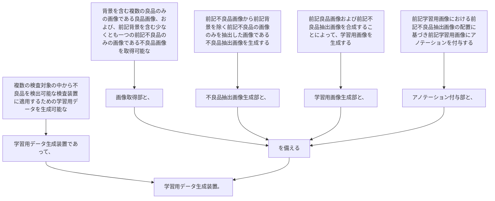

```mermaid
flowchart TD
A[複数の検査対象の中から不良品を検出可能な検査装置に適用するための学習用データを生成可能な]
B[学習用データ生成装置であって、]
C[背景を含む複数の良品のみの画像である良品画像、および、前記背景を含む少なくとも一つの前記不良品のみの画像である不良品画像を取得可能な]
D[画像取得部と、]
E[前記不良品画像から前記背景を除く前記不良品の画像のみを抽出した画像である不良品抽出画像を生成する]
F[不良品抽出画像生成部と、]
G[前記良品画像および前記不良品抽出画像を合成することによって、学習用画像を生成する]
H[学習用画像生成部と、]
I[前記学習用画像における前記不良品抽出画像の配置に基づき前記学習用画像にアノテーションを付与する]
J[アノテーション付与部と、]
K[を備える]
L[学習用データ生成装置。]

A --> B
B --> L
C --> D
E --> F
G --> H
I --> J
D --> K
F --> K
H --> K
J --> K
K --> L
```