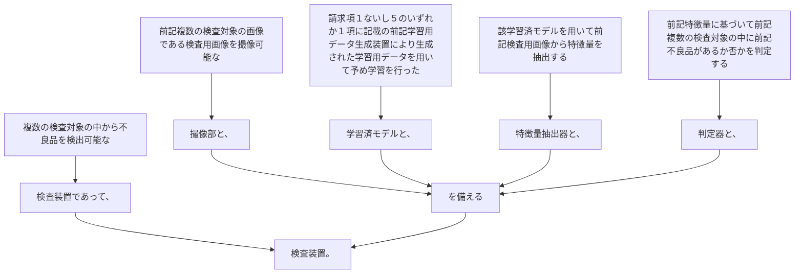

```mermaid
flowchart TD
A[複数の検査対象の中から不良品を検出可能な]
B[検査装置であって、]
C[前記複数の検査対象の画像である検査用画像を撮像可能な]
D[撮像部と、]
E[請求項１ないし５のいずれか１項に記載の前記学習用データ生成装置により生成された学習用データを用いて予め学習を行った]
F[学習済モデルと、]
G[該学習済モデルを用いて前記検査用画像から特徴量を抽出する]
H[特徴量抽出器と、]
I[前記特徴量に基づいて前記複数の検査対象の中に前記不良品があるか否かを判定する]
J[判定器と、]
K[を備える]
L[検査装置。]
A --> B
B --> L
C --> D
E --> F
G --> H
I --> J
D --> K
F --> K
H --> K
J --> K
K --> L
```