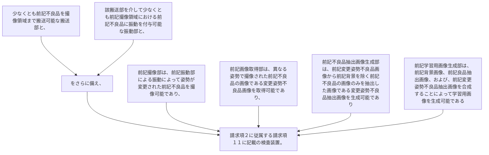

```mermaid
flowchart TD
A[少なくとも前記不良品を撮像領域まで搬送可能な搬送部と、]
B[該搬送部を介して少なくとも前記撮像領域における前記不良品に振動を付与可能な振動部と、]
C[をさらに備え、]
D[前記撮像部は、前記振動部による振動によって姿勢が変更された前記不良品を撮像可能であり、]
E[前記画像取得部は、異なる姿勢で撮像された前記不良品の画像である変更姿勢不良品画像を取得可能であり、]
F[前記不良品抽出画像生成部は、前記変更姿勢不良品画像から前記背景を除く前記不良品の画像のみを抽出した画像である変更姿勢不良品抽出画像を生成可能であり]
G[前記学習用画像生成部は、前記背景画像、前記良品抽出画像、および、前記変更姿勢不良品抽出画像を合成することによって学習用画像を生成可能である]
H[請求項２に従属する請求項１１に記載の検査装置。]
A --> C
B --> C
C --> H
D --> H
E --> H
F --> H
G --> H
```