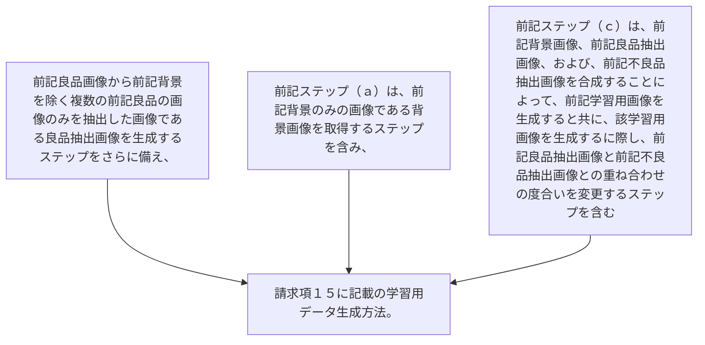

前記良品画像から前記背景を除く複数の前記良品の画像のみを抽出した画像である良品抽出画像を生成するステップをさらに備え、
前記ステップ（ａ）は、前記背景のみの画像である背景画像を取得するステップを含み、
前記ステップ（ｃ）は、前記背景画像、前記良品抽出画像、および、前記不良品抽出画像を合成することによって、前記学習用画像を生成すると共に、該学習用画像を生成するに際し、前記良品抽出画像と前記不良品抽出画像との重ね合わせの度合いを変更するステップを含む
請求項１５に記載の学習用データ生成方法。
