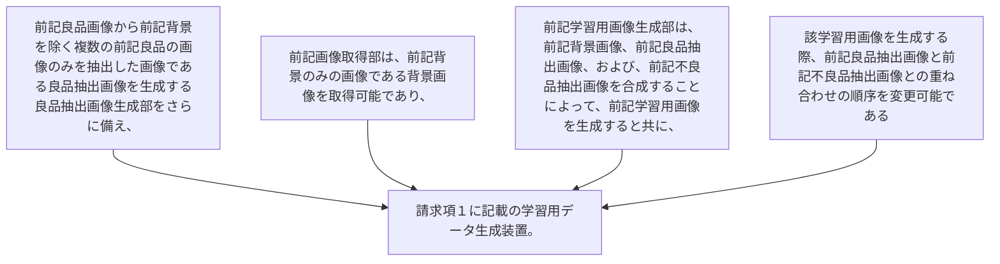

前記良品画像から前記背景を除く複数の前記良品の画像のみを抽出した画像である良品抽出画像を生成する良品抽出画像生成部をさらに備え、
前記画像取得部は、前記背景のみの画像である背景画像を取得可能であり、
前記学習用画像生成部は、前記背景画像、前記良品抽出画像、および、前記不良品抽出画像を合成することによって、前記学習用画像を生成すると共に、該学習用画像を生成する際、前記良品抽出画像と前記不良品抽出画像との重ね合わせの順序を変更可能である
請求項１に記載の学習用データ生成装置。
