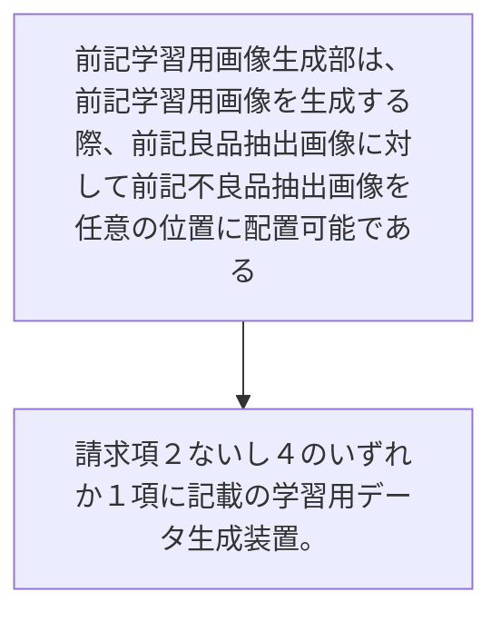

前記学習用画像生成部は、前記学習用画像を生成する際、前記良品抽出画像に対して前記不良品抽出画像を任意の位置に配置可能である
請求項２ないし４のいずれか１項に記載の学習用データ生成装置。

```mermaid
flowchart TD
A[前記学習用画像生成部は、前記学習用画像を生成する際、前記良品抽出画像に対して前記不良品抽出画像を任意の位置に配置可能である]
B[請求項２ないし４のいずれか１項に記載の学習用データ生成装置。]
A --> B
```