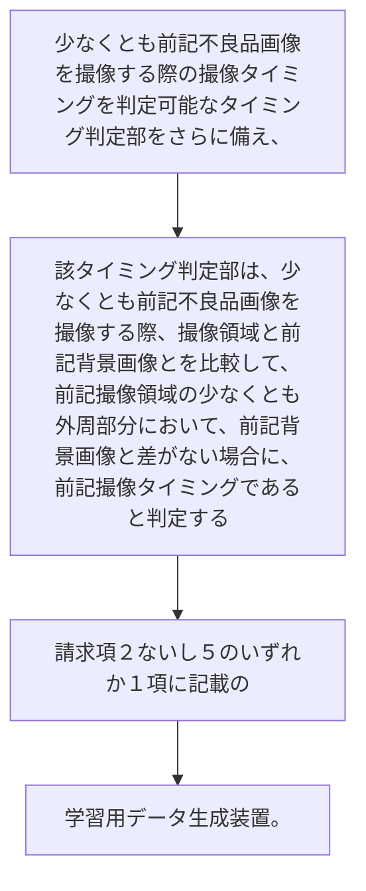

```mermaid
flowchart TD
A[少なくとも前記不良品画像を撮像する際の撮像タイミングを判定可能なタイミング判定部をさらに備え、]
B[該タイミング判定部は、少なくとも前記不良品画像を撮像する際、撮像領域と前記背景画像とを比較して、前記撮像領域の少なくとも外周部分において、前記背景画像と差がない場合に、前記撮像タイミングであると判定する]
C[請求項２ないし５のいずれか１項に記載の]
D[学習用データ生成装置。]
A --> B
B --> C
C --> D
```