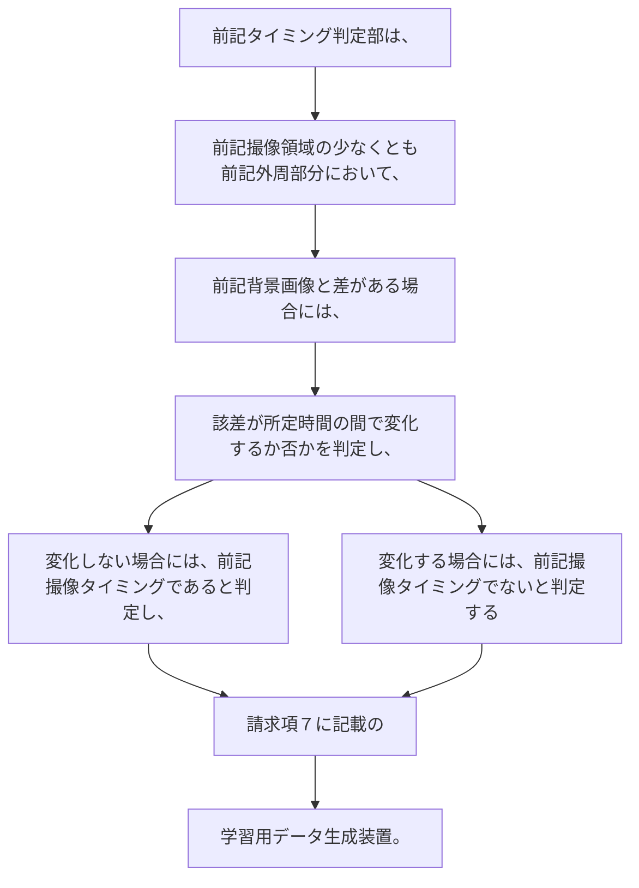

前記タイミング判定部は、前記撮像領域の少なくとも前記外周部分において、前記背景画像と差がある場合には、該差が所定時間の間で変化するか否かを判定し、変化しない場合には、前記撮像タイミングであると判定し、変化する場合には、前記撮像タイミングでないと判定する
請求項７に記載の学習用データ生成装置。

```mermaid
flowchart TD
A[前記タイミング判定部は、]
B[前記撮像領域の少なくとも前記外周部分において、]
C[前記背景画像と差がある場合には、]
D[該差が所定時間の間で変化するか否かを判定し、]
E[変化しない場合には、前記撮像タイミングであると判定し、]
F[変化する場合には、前記撮像タイミングでないと判定する]
G[請求項７に記載の]
H[学習用データ生成装置。]
A --> B
B --> C
C --> D
D --> E
D --> F
E --> G
F --> G
G --> H
```