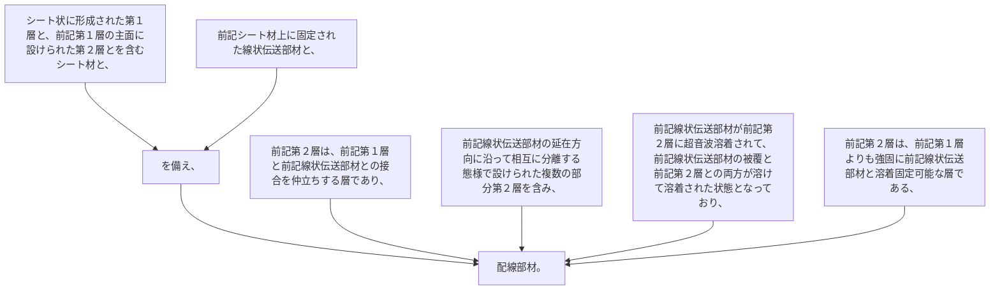

シート状に形成された第１層と、前記第１層の主面に設けられた第２層とを含むシート材と、
前記シート材上に固定された線状伝送部材と、
を備え、
前記第２層は、前記第１層と前記線状伝送部材との接合を仲立ちする層であり、前記線状伝送部材の延在方向に沿って相互に分離する態様で設けられた複数の部分第２層を含み、
前記線状伝送部材が前記第２層に超音波溶着されて、前記線状伝送部材の被覆と前記第２層との両方が溶けて溶着された状態となっており、
前記第２層は、前記第１層よりも強固に前記線状伝送部材と溶着固定可能な層である、配線部材。
