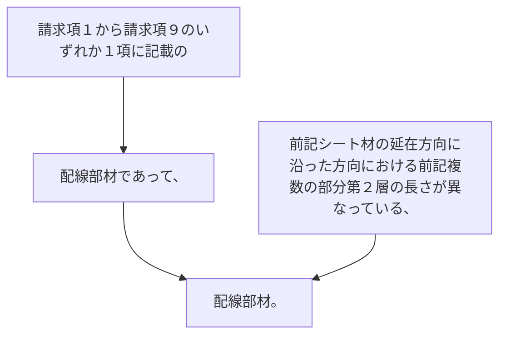

請求項１から請求項９のいずれか１項に記載の配線部材であって、
前記シート材の延在方向に沿った方向における前記複数の部分第２層の長さが異なっている、配線部材。

```mermaid
flowchart TD
A[請求項１から請求項９のいずれか１項に記載の]
B[配線部材であって、]
C[前記シート材の延在方向に沿った方向における前記複数の部分第２層の長さが異なっている、]
D[配線部材。]
A --> B
B --> D
C --> D
```