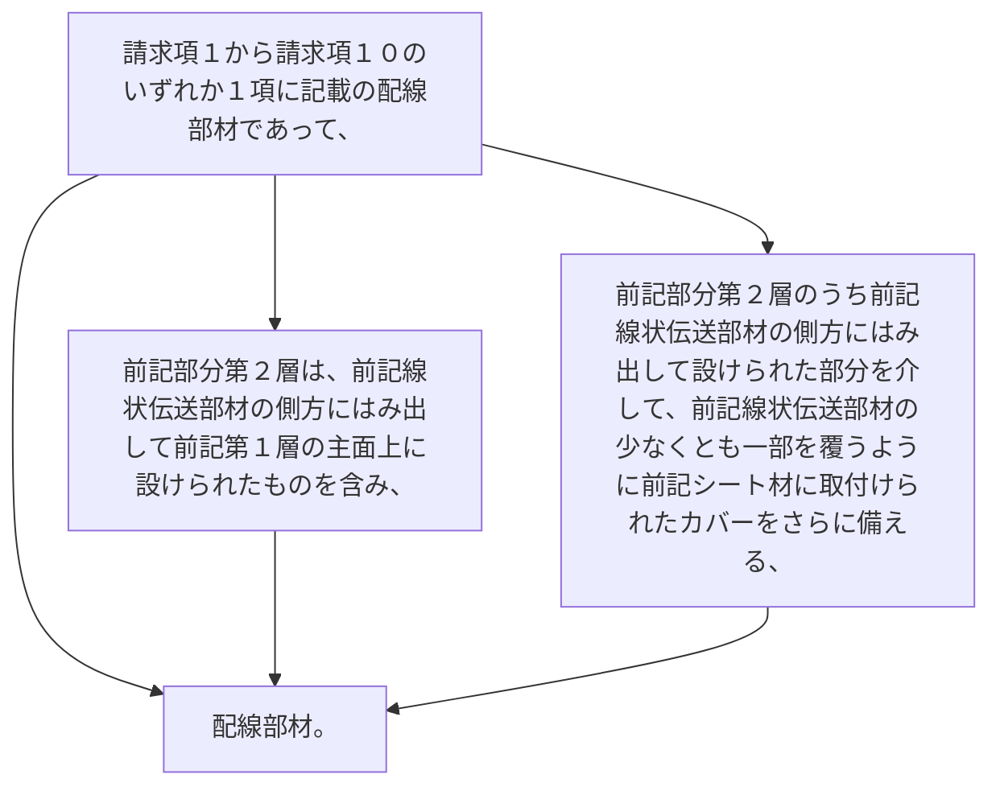

```mermaid
flowchart TD
A[請求項１から請求項１０のいずれか１項に記載の配線部材であって、]
B[前記部分第２層は、前記線状伝送部材の側方にはみ出して前記第１層の主面上に設けられたものを含み、]
C[前記部分第２層のうち前記線状伝送部材の側方にはみ出して設けられた部分を介して、前記線状伝送部材の少なくとも一部を覆うように前記シート材に取付けられたカバーをさらに備える、]
D[配線部材。]
A --> B
A --> C
A --> D
B --> D
C --> D
```