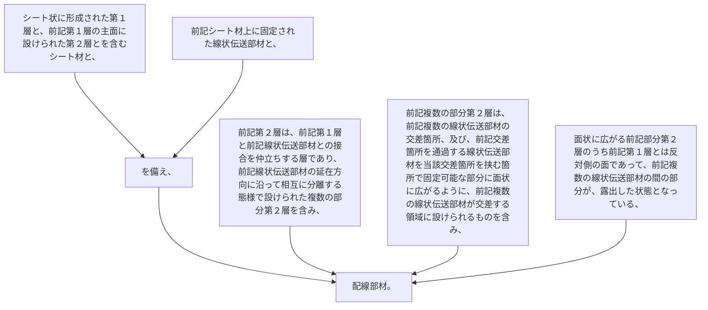

シート状に形成された第１層と、前記第１層の主面に設けられた第２層とを含むシート材と、
前記シート材上に固定された線状伝送部材と、
を備え、
前記第２層は、前記第１層と前記線状伝送部材との接合を仲立ちする層であり、前記線状伝送部材の延在方向に沿って相互に分離する態様で設けられた複数の部分第２層を含み、
前記複数の部分第２層は、前記複数の線状伝送部材の交差箇所、及び、前記交差箇所を通過する線状伝送部材を当該交差箇所を挟む箇所で固定可能な部分に面状に広がるように、前記複数の線状伝送部材が交差する領域に設けられるものを含み、
面状に広がる前記部分第２層のうち前記第１層とは反対側の面であって、前記複数の線状伝送部材の間の部分が、露出した状態となっている、配線部材。
