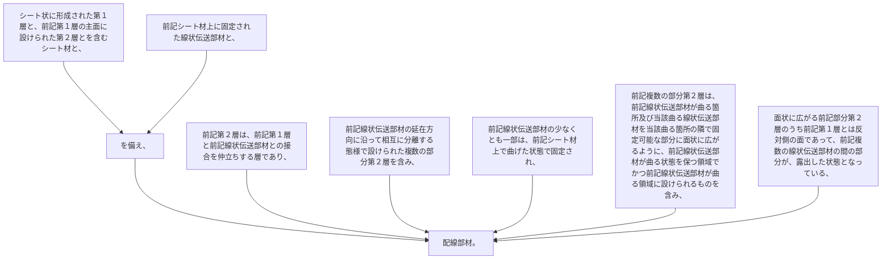

```mermaid
flowchart TD
A[シート状に形成された第１層と、前記第１層の主面に設けられた第２層とを含むシート材と、]
B[前記シート材上に固定された線状伝送部材と、]
C[を備え、]
D[前記第２層は、前記第１層と前記線状伝送部材との接合を仲立ちする層であり、]
E[前記線状伝送部材の延在方向に沿って相互に分離する態様で設けられた複数の部分第２層を含み、]
F[前記線状伝送部材の少なくとも一部は、前記シート材上で曲げた状態で固定され、]
G[前記複数の部分第２層は、前記線状伝送部材が曲る箇所及び当該曲る線状伝送部材を当該曲る箇所の隣で固定可能な部分に面状に広がるように、前記線状伝送部材が曲る状態を保つ領域でかつ前記線状伝送部材が曲る領域に設けられるものを含み、]
H[面状に広がる前記部分第２層のうち前記第１層とは反対側の面であって、前記複数の線状伝送部材の間の部分が、露出した状態となっている、]
I[配線部材。]
A --> C
B --> C
C --> I
D --> I
E --> I
F --> I
G --> I
H --> I
```