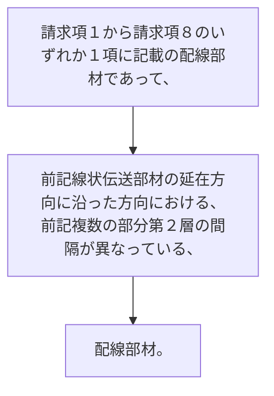

請求項１から請求項８のいずれか１項に記載の配線部材であって、
前記線状伝送部材の延在方向に沿った方向における、前記複数の部分第２層の間隔が異なっている、配線部材。

```mermaid
flowchart TD
A[請求項１から請求項８のいずれか１項に記載の配線部材であって、]
B[前記線状伝送部材の延在方向に沿った方向における、前記複数の部分第２層の間隔が異なっている、]
C[配線部材。]
A --> B
B --> C
```