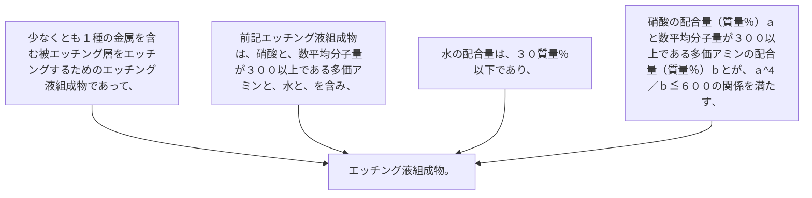

少なくとも１種の金属を含む被エッチング層をエッチングするためのエッチング液組成物であって、
前記エッチング液組成物は、硝酸と、数平均分子量が３００以上である多価アミンと、水と、を含み、
水の配合量は、３０質量％以下であり、
硝酸の配合量（質量％）ａと数平均分子量が３００以上である多価アミンの配合量（質量％）ｂとが、ａ
^4
／ｂ≦６００の関係を満たす、エッチング液組成物。

```mermaid
flowchart TD
A[少なくとも１種の金属を含む被エッチング層をエッチングするためのエッチング液組成物であって、]
B[前記エッチング液組成物は、硝酸と、数平均分子量が３００以上である多価アミンと、水と、を含み、]
C[水の配合量は、３０質量％以下であり、]
D[硝酸の配合量（質量％）ａと数平均分子量が３００以上である多価アミンの配合量（質量％）ｂとが、ａ^4 ／ｂ≦６００の関係を満たす、]
E[エッチング液組成物。]
A --> E
B --> E
C --> E
D --> E
```