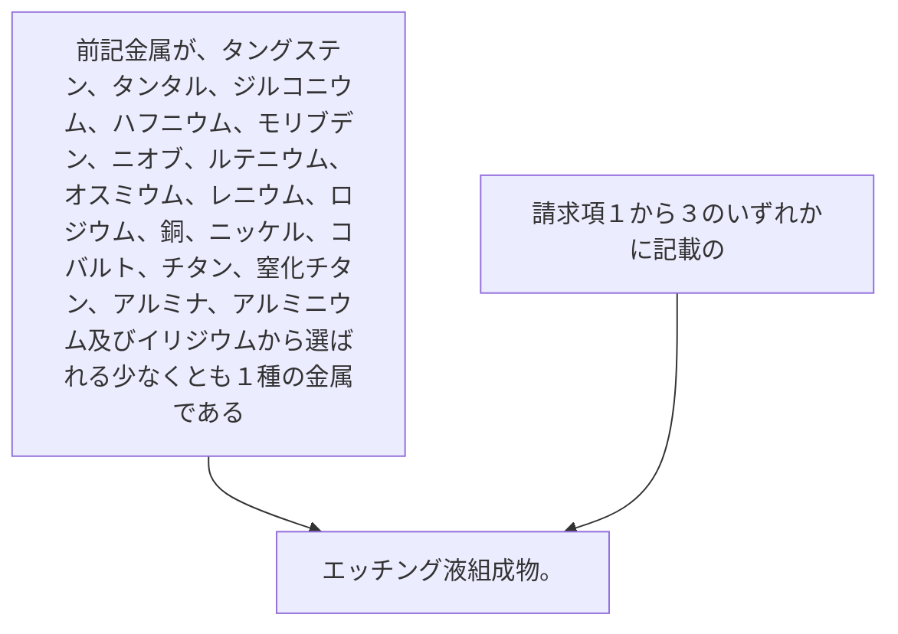

```mermaid
flowchart TD
A[前記金属が、タングステン、タンタル、ジルコニウム、ハフニウム、モリブデン、ニオブ、ルテニウム、オスミウム、レニウム、ロジウム、銅、ニッケル、コバルト、チタン、窒化チタン、アルミナ、アルミニウム及びイリジウムから選ばれる少なくとも１種の金属である]
B[請求項１から３のいずれかに記載の]
C[エッチング液組成物。]
A --> C
B --> C
```