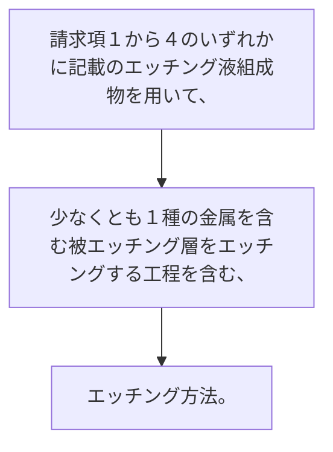

請求項１から４のいずれかに記載のエッチング液組成物を用いて、少なくとも１種の金属を含む被エッチング層をエッチングする工程を含む、エッチング方法。

```mermaid
flowchart TD
A[請求項１から４のいずれかに記載のエッチング液組成物を用いて、]
B[少なくとも１種の金属を含む被エッチング層をエッチングする工程を含む、]
C[エッチング方法。]
A --> B
B --> C
```