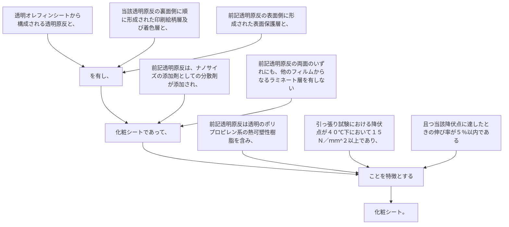

```mermaid
flowchart TD
A[透明オレフィンシートから構成される透明原反と、]
B[当該透明原反の裏面側に順に形成された印刷絵柄層及び着色層と、]
C[前記透明原反の表面側に形成された表面保護層と、]
D[を有し、]
E[前記透明原反は、ナノサイズの添加剤としての分散剤が添加され、]
F[前記透明原反の両面のいずれにも、他のフィルムからなるラミネート層を有しない]
G[化粧シートであって、]
H[前記透明原反は透明のポリプロピレン系の熱可塑性樹脂を含み、]
I[引っ張り試験における降伏点が４０℃下において１５Ｎ／ｍｍ^２以上であり、]
J[且つ当該降伏点に達したときの伸び率が５％以内である]
K[ことを特徴とする]
L[化粧シート。]
A --> D
B --> D
C --> D
D --> G
E --> G
F --> G
G --> K
H --> K
I --> K
J --> K
K --> L
```