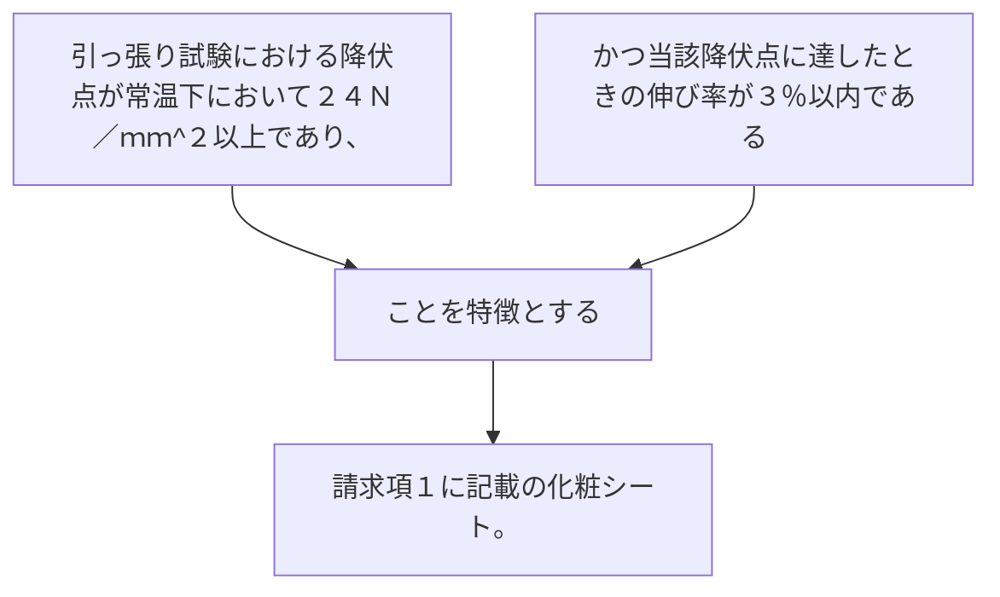

引っ張り試験における降伏点が常温下において２４Ｎ／ｍｍ
^２
以上であり、かつ当該降伏点に達したときの伸び率が３％以内であることを特徴とする請求項１に記載の化粧シート。

```mermaid
flowchart TD
A[引っ張り試験における降伏点が常温下において２４Ｎ／ｍｍ^２以上であり、]
B[かつ当該降伏点に達したときの伸び率が３％以内である]
C[ことを特徴とする]
D[請求項１に記載の化粧シート。]
A --> C
B --> C
C --> D
```