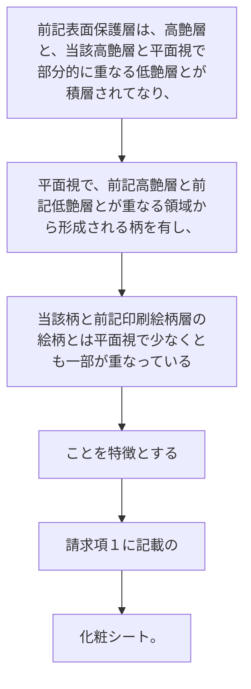

```mermaid
flowchart TD
A[前記表面保護層は、高艶層と、当該高艶層と平面視で部分的に重なる低艶層とが積層されてなり、]
B[平面視で、前記高艶層と前記低艶層とが重なる領域から形成される柄を有し、]
C[当該柄と前記印刷絵柄層の絵柄とは平面視で少なくとも一部が重なっている]
D[ことを特徴とする]
E[請求項１に記載の]
F[化粧シート。]
A --> B
B --> C
C --> D
D --> E
E --> F
```