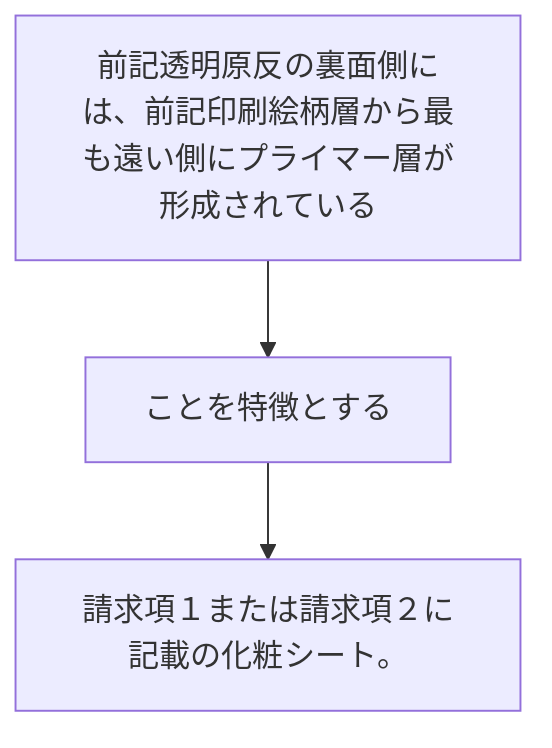

前記透明原反の裏面側には、前記印刷絵柄層から最も遠い側にプライマー層が形成されていることを特徴とする請求項１または請求項２に記載の化粧シート。

```mermaid
flowchart TD
A[前記透明原反の裏面側には、前記印刷絵柄層から最も遠い側にプライマー層が形成されている]
B[ことを特徴とする]
C[請求項１または請求項２に記載の化粧シート。]
A --> B
B --> C
```