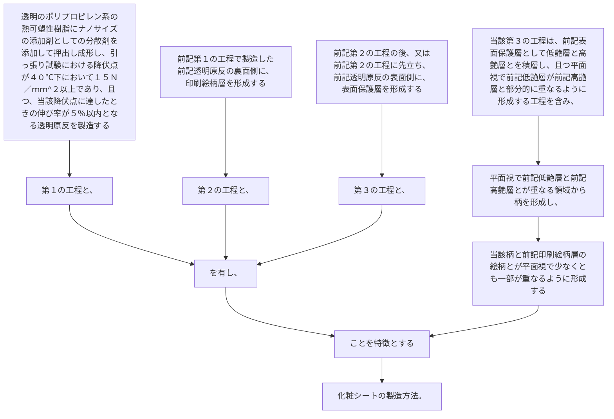

透明のポリプロピレン系の熱可塑性樹脂にナノサイズの添加剤としての分散剤を添加して押出し成形し、引っ張り試験における降伏点が４０℃下において１５Ｎ／ｍｍ
^２
以上であり、且つ、当該降伏点に達したときの伸び率が５％以内となる透明原反を製造する第１の工程と、
前記第１の工程で製造した前記透明原反の裏面側に、印刷絵柄層を形成する第２の工程と、
前記第２の工程の後、又は前記第２の工程に先立ち、前記透明原反の表面側に、表面保護層を形成する第３の工程と、を有し、
当該第３の工程は、前記表面保護層として低艶層と高艶層とを積層し、且つ平面視で前記低艶層が前記高艶層と部分的に重なるように形成する工程を含み、平面視で前記低艶層と前記高艶層とが重なる領域から柄を形成し、当該柄と前記印刷絵柄層の絵柄とが平面視で少なくとも一部が重なるように形成することを特徴とする化粧シートの製造方法。
