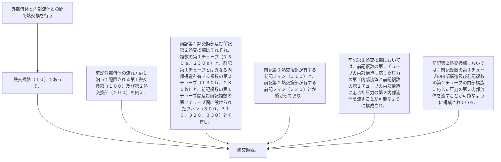

```mermaid
flowchart TD
A[外部流体と内部流体との間で熱交換を行う]
B[熱交換器（１０）であって、]
C[前記外部流体の流れ方向に沿って配置される第１熱交換部（１００）及び第２熱交換部（２００）を備え、]
D[前記第１熱交換部及び前記第２熱交換部はそれぞれ、複数の第１チューブ（１３０ａ，２３０ａ）と、前記第１チューブとは異なる内部構造を有する複数の第２チューブ（１３０ｂ，２３０ｂ）と、前記複数の第１チューブ間及び前記複数の第２チューブ間に設けられたフィン（３００，３１０，３２０，３３０）とを有し、]
E[前記第１熱交換部が有する前記フィン（３１０）と、前記第２熱交換部が有する前記フィン（３２０）とが繋がっており、]
F[前記第１熱交換部においては、前記複数の第１チューブの内部構造に応じた圧力の第１内部流体と前記複数の第２チューブの内部構造に応じた圧力の第２内部流体を流すことが可能なように構成され、]
G[前記第２熱交換部においては、前記複数の第１チューブの内部構造及び前記複数の第２チューブの内部構造に応じた圧力の第３内部流体を流すことが可能なように構成されている、]
H[熱交換器。]
A --> B
B --> H
C --> H
D --> H
E --> H
F --> H
G --> H
```