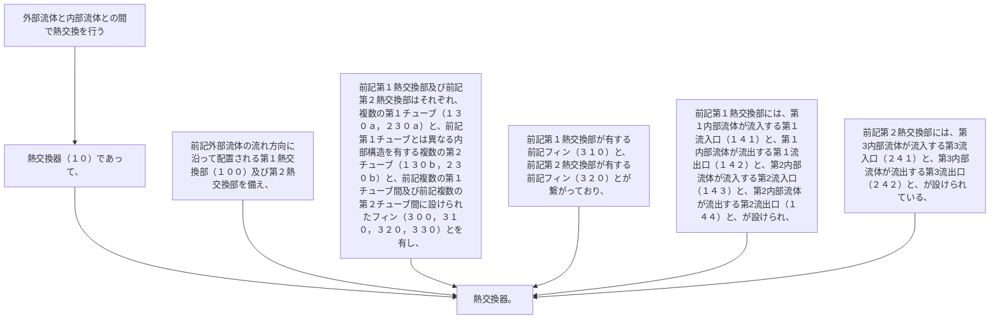

外部流体と内部流体との間で熱交換を行う熱交換器（１０）であって、
前記外部流体の流れ方向に沿って配置される第１熱交換部（１００）及び第２熱交換部を備え、
前記第１熱交換部及び前記第２熱交換部はそれぞれ、複数の第１チューブ（１３０ａ，２３０ａ）と、前記第１チューブとは異なる内部構造を有する複数の第２チューブ（１３０ｂ，２３０ｂ）と、前記複数の第１チューブ間及び前記複数の第２チューブ間に設けられたフィン（３００，３１０，３２０，３３０）とを有し、
前記第１熱交換部が有する前記フィン（３１０）と、前記第２熱交換部が有する前記フィン（３２０）とが繋がっており、
前記第１熱交換部には、第１内部流体が流入する第１流入口（１４１）と、第１内部流体が流出する第１流出口（１４２）と、第２内部流体が流入する第２流入口（１４３）と、第２内部流体が流出する第２流出口（１４４）と、が設けられ、
前記第２熱交換部には、第３内部流体が流入する第３流入口（２４１）と、第３内部流体が流出する第３流出口（２４２）と、が設けられている、熱交換器。
