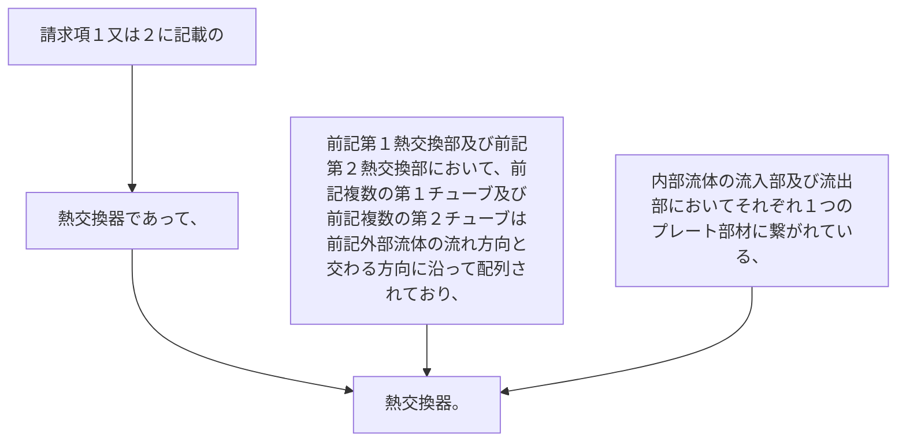

```mermaid
flowchart TD
A[請求項１又は２に記載の]
B[熱交換器であって、]
C[前記第１熱交換部及び前記第２熱交換部において、前記複数の第１チューブ及び前記複数の第２チューブは前記外部流体の流れ方向と交わる方向に沿って配列されており、]
D[内部流体の流入部及び流出部においてそれぞれ１つのプレート部材に繋がれている、]
E[熱交換器。]
A --> B
B --> E
C --> E
D --> E
```