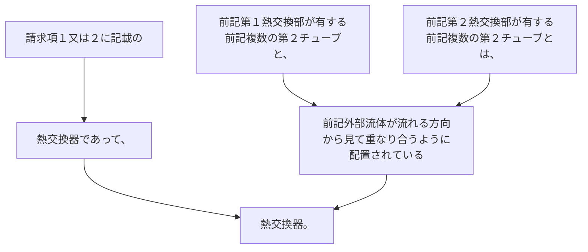

請求項１又は２に記載の熱交換器であって、
前記第１熱交換部が有する前記複数の第２チューブと、前記第２熱交換部が有する前記複数の第２チューブとは、前記外部流体が流れる方向から見て重なり合うように配置されている、熱交換器。

```mermaid
flowchart TD
A[請求項１又は２に記載の]
B[熱交換器であって、]
C[前記第１熱交換部が有する前記複数の第２チューブと、]
D[前記第２熱交換部が有する前記複数の第２チューブとは、]
E[前記外部流体が流れる方向から見て重なり合うように配置されている]
F[熱交換器。]
A --> B
B --> F
C --> E
D --> E
E --> F
```