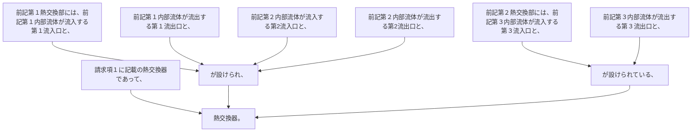

```mermaid
flowchart TD
A[請求項１に記載の熱交換器であって、]
B[前記第１熱交換部には、前記第１内部流体が流入する第１流入口と、]
C[前記第１内部流体が流出する第１流出口と、]
D[前記第２内部流体が流入する第2流入口と、]
E[前記第２内部流体が流出する第2流出口と、]
F[が設けられ、]
G[前記第２熱交換部には、前記第３内部流体が流入する第３流入口と、]
H[前記第３内部流体が流出する第３流出口と、]
I[が設けられている、]
J[熱交換器。]
A --> J
B --> F
C --> F
D --> F
E --> F
F --> J
G --> I
H --> I
I --> J
```