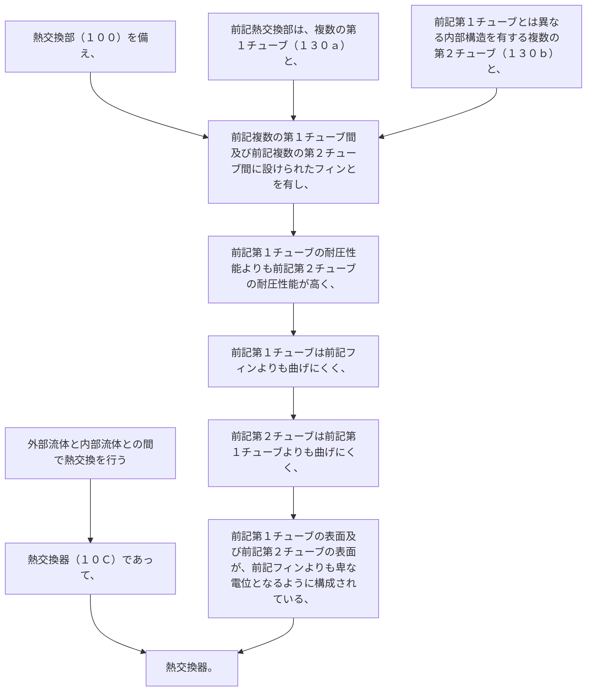

外部流体と内部流体との間で熱交換を行う熱交換器（１０Ｃ）であって、
熱交換部（１００）を備え、
前記熱交換部は、複数の第１チューブ（１３０ａ）と、前記第１チューブとは異なる内部構造を有する複数の第２チューブ（１３０ｂ）と、前記複数の第１チューブ間及び前記複数の第２チューブ間に設けられたフィンとを有し、
前記第１チューブの耐圧性能よりも前記第２チューブの耐圧性能が高く、
前記第１チューブは前記フィンよりも曲げにくく、前記第２チューブは前記第１チューブよりも曲げにくく、
前記第１チューブの表面及び前記第２チューブの表面が、前記フィンよりも卑な電位となるように構成されている、熱交換器。
