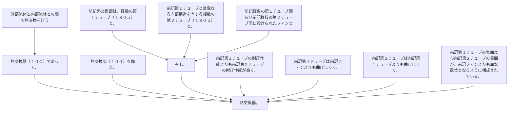

```mermaid
flowchart TD
A[外部流体と内部流体との間で熱交換を行う]
B[熱交換器（１０Ｃ）であって、]
C[熱交換部（１００）を備え、]
D[前記熱交換部は、複数の第１チューブ（１３０ａ）と、]
E[前記第１チューブとは異なる内部構造を有する複数の第２チューブ（１３０ｂ）と、]
F[前記複数の第１チューブ間及び前記複数の第２チューブ間に設けられたフィンと]
G[有し、]
H[前記第１チューブの耐圧性能よりも前記第２チューブの耐圧性能が高く、]
I[前記第１チューブは前記フィンよりも曲げにくく、]
J[前記第２チューブは前記第１チューブよりも曲げにくく、]
K[前記第１チューブの表面及び前記第２チューブの表面が、前記フィンよりも卑な電位となるように構成されている、]
L[熱交換器。]
A --> B
B --> L
C --> L
D --> G
E --> G
F --> G
G --> L
H --> L
I --> L
J --> L
K --> L
```