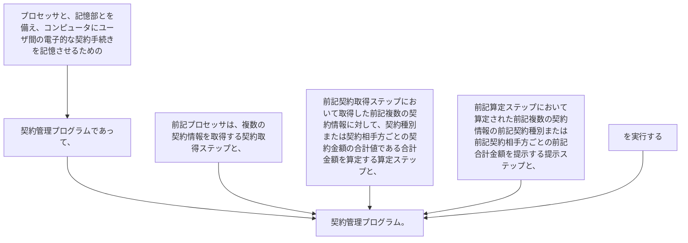

```mermaid
flowchart TD
A[プロセッサと、記憶部とを備え、コンピュータにユーザ間の電子的な契約手続きを記憶させるための]
B[契約管理プログラムであって、]
C[前記プロセッサは、複数の契約情報を取得する契約取得ステップと、]
D[前記契約取得ステップにおいて取得した前記複数の契約情報に対して、契約種別または契約相手方ごとの契約金額の合計値である合計金額を算定する算定ステップと、]
E[前記算定ステップにおいて算定された前記複数の契約情報の前記契約種別または前記契約相手方ごとの前記合計金額を提示する提示ステップと、]
F[を実行する]
G[契約管理プログラム。]
A --> B
B --> G
C --> G
D --> G
E --> G
F --> G
```