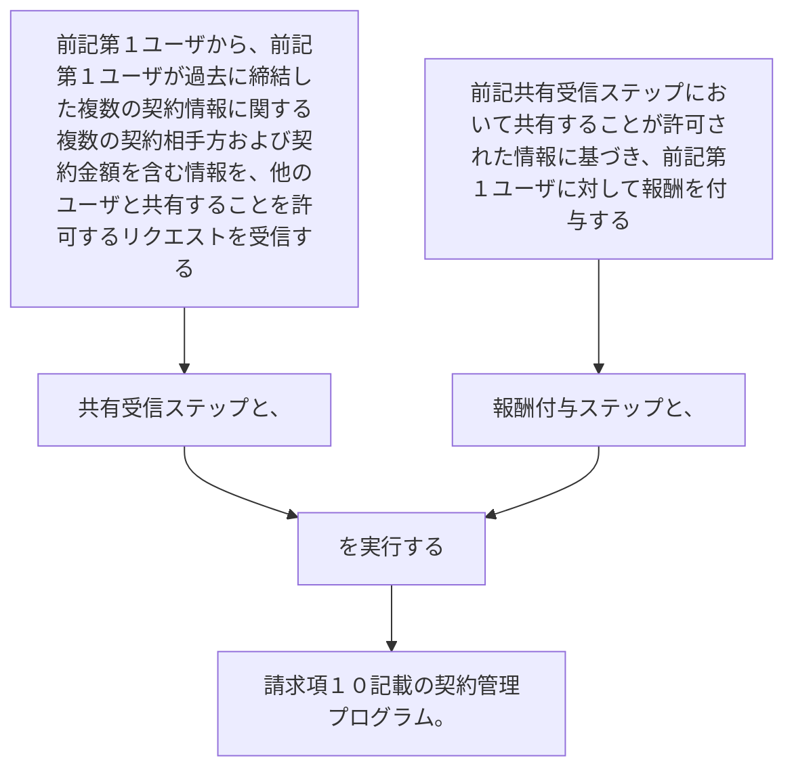

```mermaid
flowchart TD
A[前記第１ユーザから、前記第１ユーザが過去に締結した複数の契約情報に関する複数の契約相手方および契約金額を含む情報を、他のユーザと共有することを許可するリクエストを受信する]
B[共有受信ステップと、]
C[前記共有受信ステップにおいて共有することが許可された情報に基づき、前記第１ユーザに対して報酬を付与する]
D[報酬付与ステップと、]
E[を実行する]
F[請求項１０記載の契約管理プログラム。]
A --> B
C --> D
B --> E
D --> E
E --> F
```