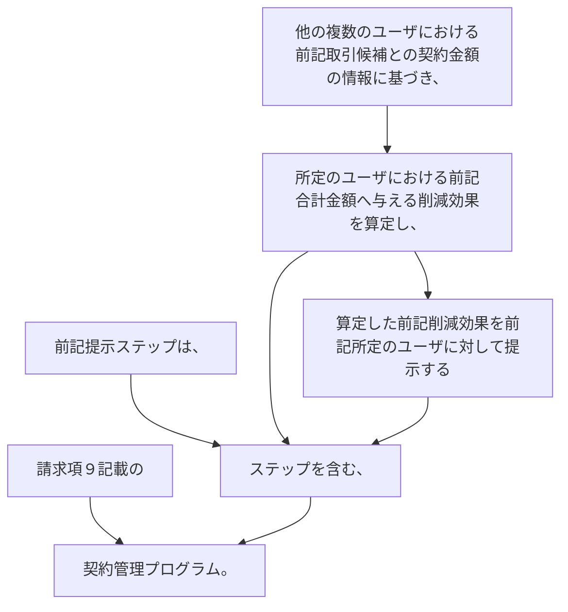

```mermaid
flowchart TD
A[前記提示ステップは、]
B[他の複数のユーザにおける前記取引候補との契約金額の情報に基づき、]
C[所定のユーザにおける前記合計金額へ与える削減効果を算定し、]
D[算定した前記削減効果を前記所定のユーザに対して提示する]
E[ステップを含む、]
F[請求項９記載の]
G[契約管理プログラム。]

A --> E
B --> C
C --> D
C --> E
D --> E
F --> G
E --> G
```