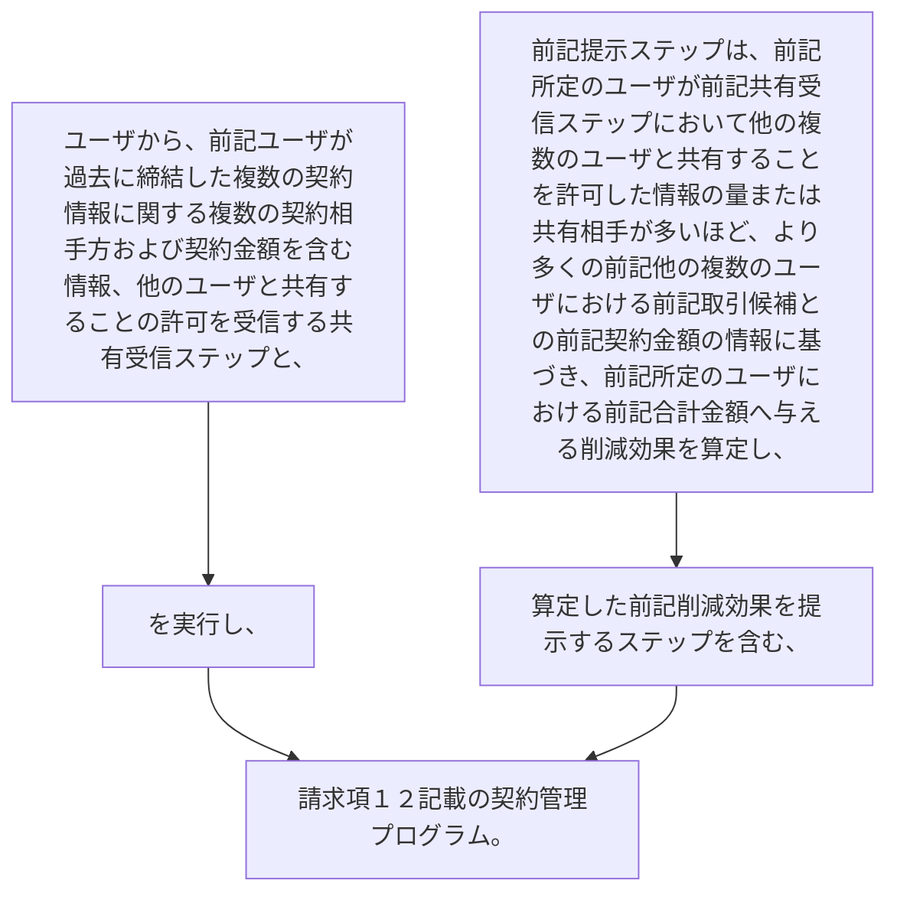

```mermaid
flowchart TD
A[ユーザから、前記ユーザが過去に締結した複数の契約情報に関する複数の契約相手方および契約金額を含む情報、他のユーザと共有することの許可を受信する共有受信ステップと、]
B[を実行し、]
C[前記提示ステップは、前記所定のユーザが前記共有受信ステップにおいて他の複数のユーザと共有することを許可した情報の量または共有相手が多いほど、より多くの前記他の複数のユーザにおける前記取引候補との前記契約金額の情報に基づき、前記所定のユーザにおける前記合計金額へ与える削減効果を算定し、]
D[算定した前記削減効果を提示するステップを含む、]
E[請求項１２記載の契約管理プログラム。]
A --> B
B --> E
C --> D
D --> E
```