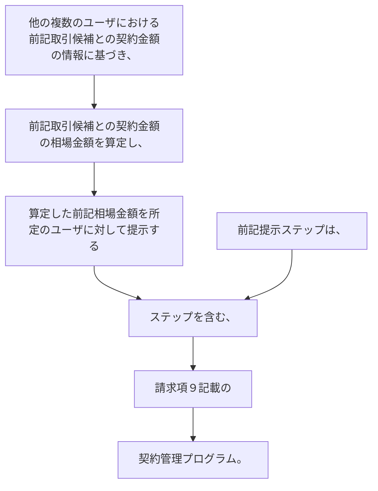

前記提示ステップは、他の複数のユーザにおける前記取引候補との契約金額の情報に基づき、前記取引候補との契約金額の相場金額を算定し、算定した前記相場金額を所定のユーザに対して提示するステップを含む、
請求項９記載の契約管理プログラム。

```mermaid
flowchart TD
A[前記提示ステップは、]
B[他の複数のユーザにおける前記取引候補との契約金額の情報に基づき、]
C[前記取引候補との契約金額の相場金額を算定し、]
D[算定した前記相場金額を所定のユーザに対して提示する]
E[ステップを含む、]
F[請求項９記載の]
G[契約管理プログラム。]
B --> C
C --> D
D --> E
A --> E
E --> F
F --> G
```