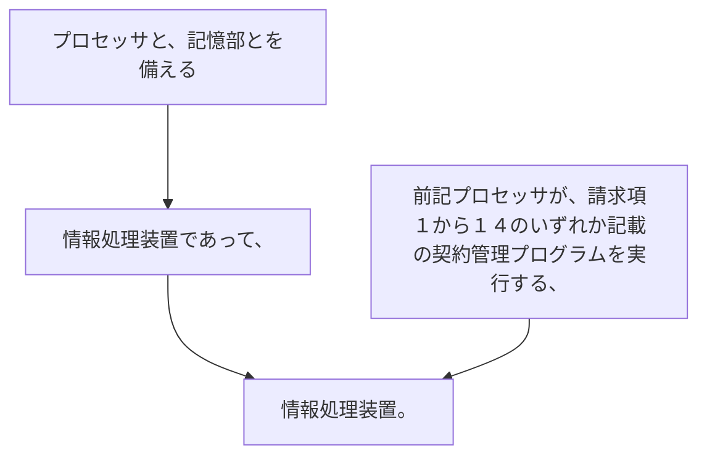

プロセッサと、記憶部とを備える情報処理装置であって、
前記プロセッサが、請求項１から１４のいずれか記載の契約管理プログラムを実行する、
情報処理装置。

```mermaid
flowchart TD
A[プロセッサと、記憶部とを備える]
B[情報処理装置であって、]
C[前記プロセッサが、請求項１から１４のいずれか記載の契約管理プログラムを実行する、]
D[情報処理装置。]
A --> B
B --> D
C --> D
```