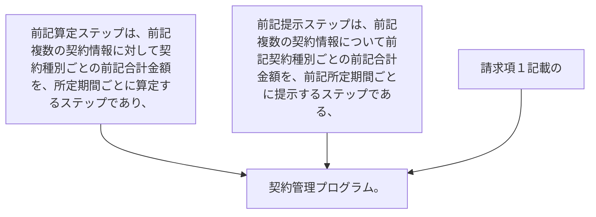

```mermaid
flowchart TD
A[前記算定ステップは、前記複数の契約情報に対して契約種別ごとの前記合計金額を、所定期間ごとに算定するステップであり、]
B[前記提示ステップは、前記複数の契約情報について前記契約種別ごとの前記合計金額を、前記所定期間ごとに提示するステップである、]
C[請求項１記載の]
D[契約管理プログラム。]
A --> D
B --> D
C --> D
```