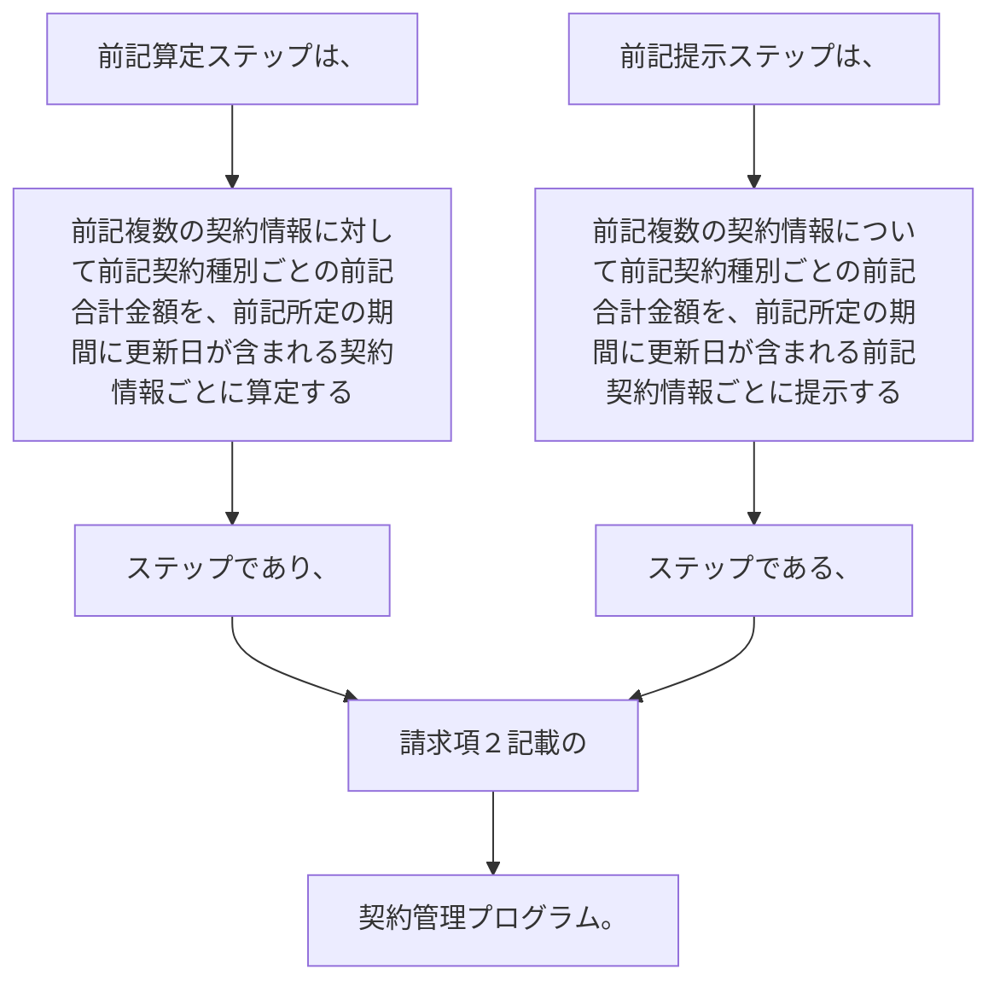

```mermaid
flowchart TD
A[前記算定ステップは、]
B[前記複数の契約情報に対して前記契約種別ごとの前記合計金額を、前記所定の期間に更新日が含まれる契約情報ごとに算定する]
C[ステップであり、]
D[前記提示ステップは、]
E[前記複数の契約情報について前記契約種別ごとの前記合計金額を、前記所定の期間に更新日が含まれる前記契約情報ごとに提示する]
F[ステップである、]
G[請求項２記載の]
H[契約管理プログラム。]
A --> B
B --> C
D --> E
E --> F
C --> G
F --> G
G --> H
```