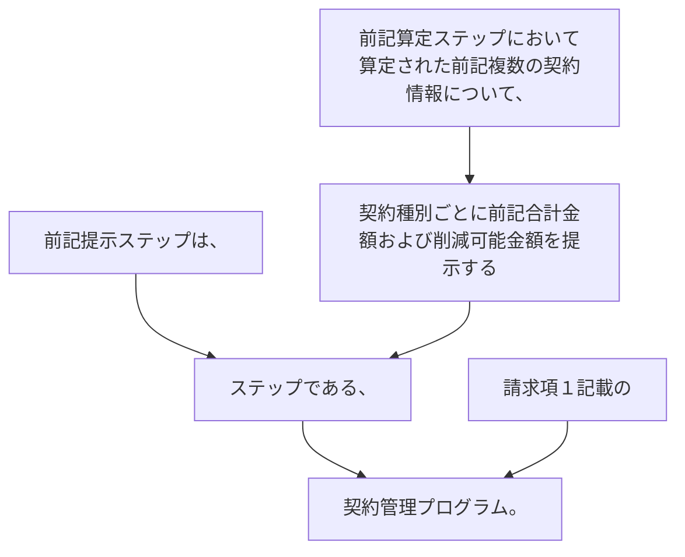

前記提示ステップは、前記算定ステップにおいて算定された前記複数の契約情報について、契約種別ごとに前記合計金額および削減可能金額を提示するステップである、
請求項１記載の契約管理プログラム。

```mermaid
flowchart TD
A[前記提示ステップは、]
B[前記算定ステップにおいて算定された前記複数の契約情報について、]
C[契約種別ごとに前記合計金額および削減可能金額を提示する]
D[ステップである、]
E[請求項１記載の]
F[契約管理プログラム。]
A --> D
B --> C
C --> D
D --> F
E --> F
```