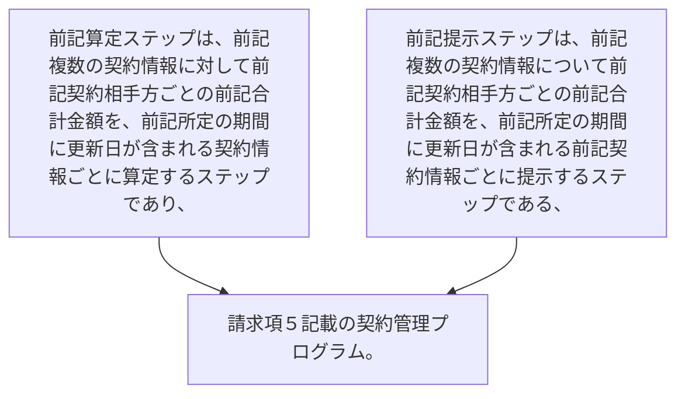

前記算定ステップは、前記複数の契約情報に対して前記契約相手方ごとの前記合計金額を、前記所定の期間に更新日が含まれる契約情報ごとに算定するステップであり、
前記提示ステップは、前記複数の契約情報について前記契約相手方ごとの前記合計金額を、前記所定の期間に更新日が含まれる前記契約情報ごとに提示するステップである、
請求項５記載の契約管理プログラム。

```mermaid
flowchart TD
A[前記算定ステップは、前記複数の契約情報に対して前記契約相手方ごとの前記合計金額を、前記所定の期間に更新日が含まれる契約情報ごとに算定するステップであり、]
B[前記提示ステップは、前記複数の契約情報について前記契約相手方ごとの前記合計金額を、前記所定の期間に更新日が含まれる前記契約情報ごとに提示するステップである、]
C[請求項５記載の契約管理プログラム。]
A --> C
B --> C
```