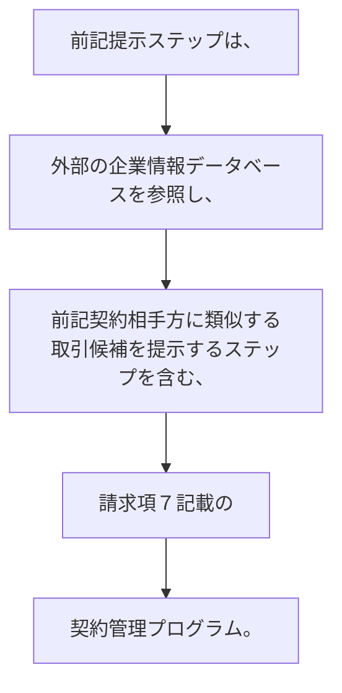

前記提示ステップは、外部の企業情報データベースを参照し、前記契約相手方に類似する取引候補を提示するステップを含む、
請求項７記載の契約管理プログラム。

```mermaid
flowchart TD
A[前記提示ステップは、]
B[外部の企業情報データベースを参照し、]
C[前記契約相手方に類似する取引候補を提示するステップを含む、]
D[請求項７記載の]
E[契約管理プログラム。]
A --> B
B --> C
C --> D
D --> E
```