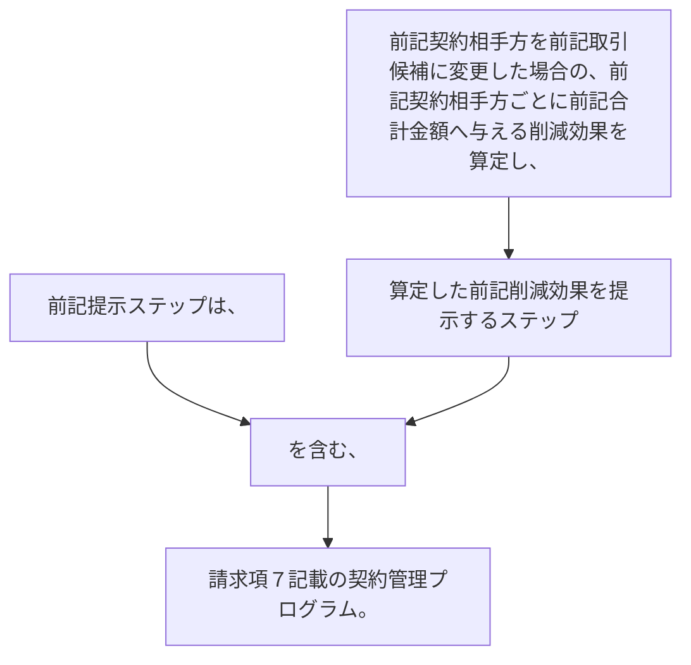

前記提示ステップは、前記契約相手方を前記取引候補に変更した場合の、前記契約相手方ごとに前記合計金額へ与える削減効果を算定し、算定した前記削減効果を提示するステップを含む、
請求項７記載の契約管理プログラム。

```mermaid
flowchart TD
A[前記提示ステップは、]
B[前記契約相手方を前記取引候補に変更した場合の、前記契約相手方ごとに前記合計金額へ与える削減効果を算定し、]
C[算定した前記削減効果を提示するステップ]
D[を含む、]
E[請求項７記載の契約管理プログラム。]
B --> C
A --> D
C --> D
D --> E
```