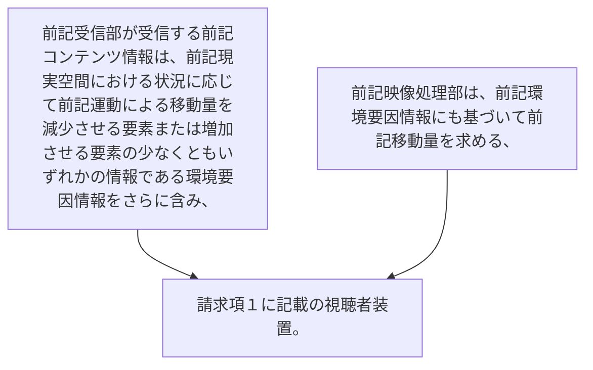

前記受信部が受信する前記コンテンツ情報は、前記現実空間における状況に応じて前記運動による移動量を減少させる要素または増加させる要素の少なくともいずれかの情報である環境要因情報をさらに含み、
前記映像処理部は、前記環境要因情報にも基づいて前記移動量を求める、
請求項１に記載の視聴者装置。

```mermaid
flowchart TD
A[前記受信部が受信する前記コンテンツ情報は、前記現実空間における状況に応じて前記運動による移動量を減少させる要素または増加させる要素の少なくともいずれかの情報である環境要因情報をさらに含み、]
B[前記映像処理部は、前記環境要因情報にも基づいて前記移動量を求める、]
C[請求項１に記載の視聴者装置。]
A --> C
B --> C
```