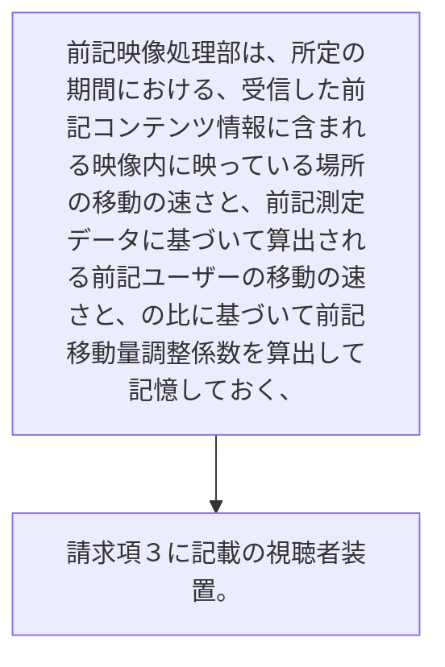

前記映像処理部は、所定の期間における、受信した前記コンテンツ情報に含まれる映像内に映っている場所の移動の速さと、前記測定データに基づいて算出される前記ユーザーの移動の速さと、の比に基づいて前記移動量調整係数を算出して記憶しておく、
請求項３に記載の視聴者装置。

```mermaid
flowchart TD
A[前記映像処理部は、所定の期間における、受信した前記コンテンツ情報に含まれる映像内に映っている場所の移動の速さと、前記測定データに基づいて算出される前記ユーザーの移動の速さと、の比に基づいて前記移動量調整係数を算出して記憶しておく、]
B[請求項３に記載の視聴者装置。]
A --> B
```