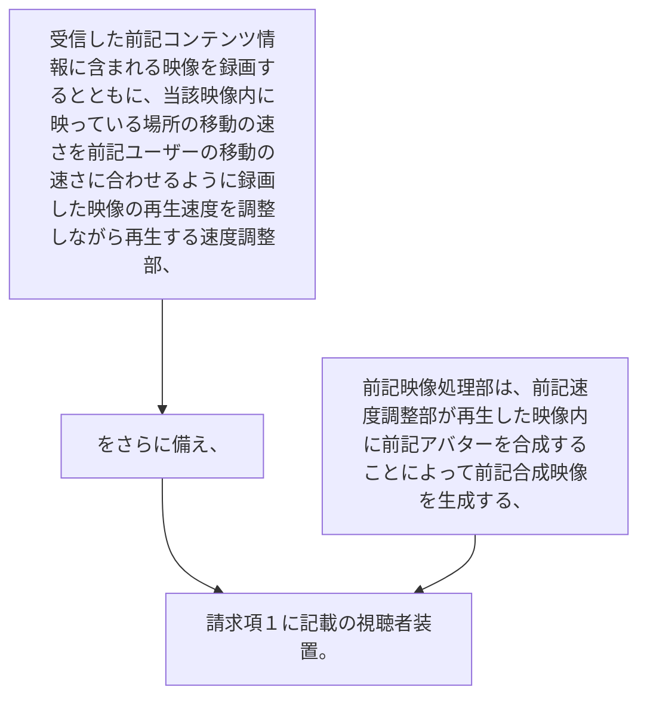

```mermaid
flowchart TD
A[受信した前記コンテンツ情報に含まれる映像を録画するとともに、当該映像内に映っている場所の移動の速さを前記ユーザーの移動の速さに合わせるように録画した映像の再生速度を調整しながら再生する速度調整部、]
B[をさらに備え、]
C[前記映像処理部は、前記速度調整部が再生した映像内に前記アバターを合成することによって前記合成映像を生成する、]
D[請求項１に記載の視聴者装置。]
A --> B
B --> D
C --> D
```