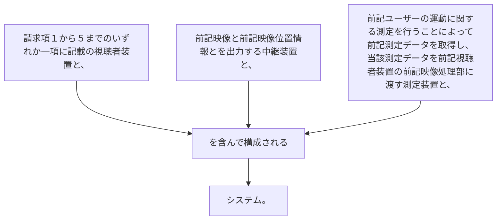

請求項１から５までのいずれか一項に記載の視聴者装置と、
前記映像と前記映像位置情報とを出力する中継装置と、
前記ユーザーの運動に関する測定を行うことによって前記測定データを取得し、当該測定データを前記視聴者装置の前記映像処理部に渡す測定装置と、
を含んで構成されるシステム。

```mermaid
flowchart TD
A[請求項１から５までのいずれか一項に記載の視聴者装置と、]
B[前記映像と前記映像位置情報とを出力する中継装置と、]
C[前記ユーザーの運動に関する測定を行うことによって前記測定データを取得し、当該測定データを前記視聴者装置の前記映像処理部に渡す測定装置と、]
D[を含んで構成される]
E[システム。]
A --> D
B --> D
C --> D
D --> E
```