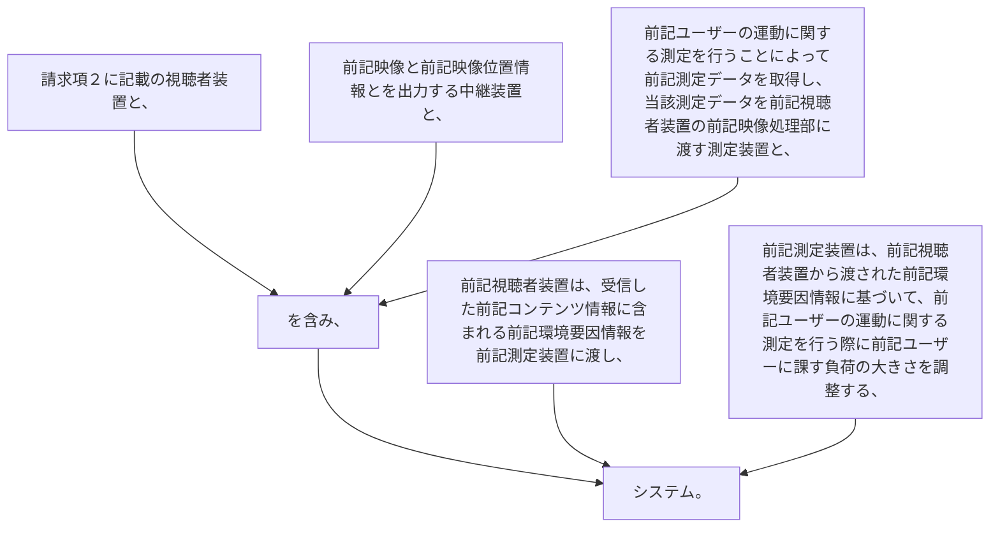

請求項２に記載の視聴者装置と、
前記映像と前記映像位置情報とを出力する中継装置と、
前記ユーザーの運動に関する測定を行うことによって前記測定データを取得し、当該測定データを前記視聴者装置の前記映像処理部に渡す測定装置と、
を含み、
前記視聴者装置は、受信した前記コンテンツ情報に含まれる前記環境要因情報を前記測定装置に渡し、
前記測定装置は、前記視聴者装置から渡された前記環境要因情報に基づいて、前記ユーザーの運動に関する測定を行う際に前記ユーザーに課す負荷の大きさを調整する、
システム。
