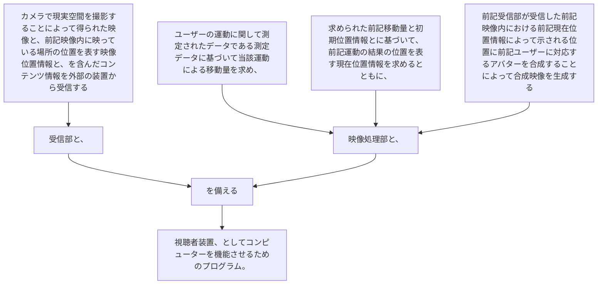

カメラで現実空間を撮影することによって得られた映像と、前記映像内に映っている場所の位置を表す映像位置情報と、を含んだコンテンツ情報を外部の装置から受信する受信部と、
ユーザーの運動に関して測定されたデータである測定データに基づいて当該運動による移動量を求め、求められた前記移動量と初期位置情報とに基づいて、前記運動の結果の位置を表す現在位置情報を求めるとともに、前記受信部が受信した前記映像内における前記現在位置情報によって示される位置に前記ユーザーに対応するアバターを合成することによって合成映像を生成する映像処理部と、
を備える視聴者装置、としてコンピューターを機能させるためのプログラム。
