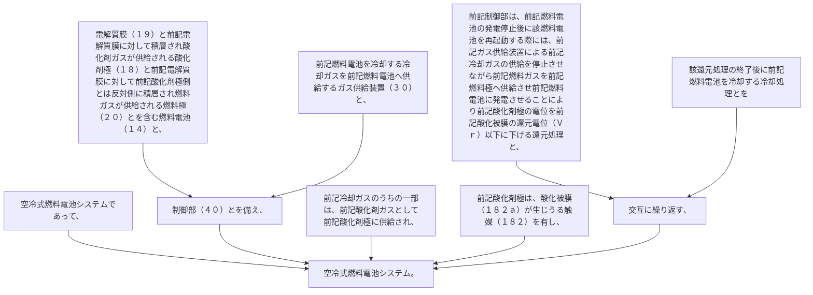

```mermaid
flowchart TD
A[空冷式燃料電池システムであって、]
B[電解質膜（１９）と前記電解質膜に対して積層され酸化剤ガスが供給される酸化剤極（１８）と前記電解質膜に対して前記酸化剤極側とは反対側に積層され燃料ガスが供給される燃料極（２０）とを含む燃料電池（１４）と、]
C[前記燃料電池を冷却する冷却ガスを前記燃料電池へ供給するガス供給装置（３０）と、]
D[制御部（４０）とを備え、]
E[前記冷却ガスのうちの一部は、前記酸化剤ガスとして前記酸化剤極に供給され、]
F[前記酸化剤極は、酸化被膜（１８２ａ）が生じうる触媒（１８２）を有し、]
G[前記制御部は、前記燃料電池の発電停止後に該燃料電池を再起動する際には、前記ガス供給装置による前記冷却ガスの供給を停止させながら前記燃料ガスを前記燃料極へ供給させ前記燃料電池に発電させることにより前記酸化剤極の電位を前記酸化被膜の還元電位（Ｖｒ）以下に下げる還元処理と、]
H[該還元処理の終了後に前記燃料電池を冷却する冷却処理とを]
I[交互に繰り返す、]
J[空冷式燃料電池システム。]
A --> J
B --> D
C --> D
D --> J
E --> J
F --> J
G --> I
H --> I
I --> J
```