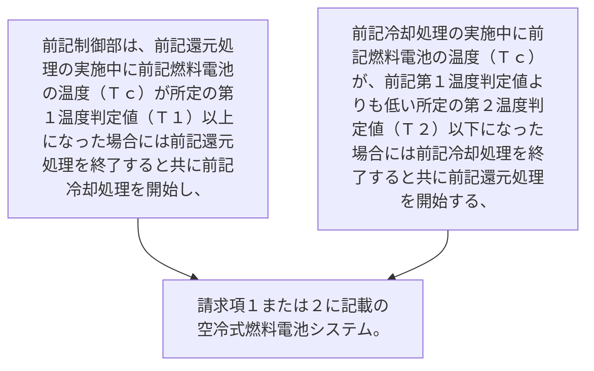

```mermaid
flowchart TD
A["前記制御部は、前記還元処理の実施中に前記燃料電池の温度（Ｔｃ）が所定の第１温度判定値（Ｔ１）以上になった場合には前記還元処理を終了すると共に前記冷却処理を開始し、"]
B["前記冷却処理の実施中に前記燃料電池の温度（Ｔｃ）が、前記第１温度判定値よりも低い所定の第２温度判定値（Ｔ２）以下になった場合には前記冷却処理を終了すると共に前記還元処理を開始する、"]
C["請求項１または２に記載の空冷式燃料電池システム。"]
A --> C
B --> C
```