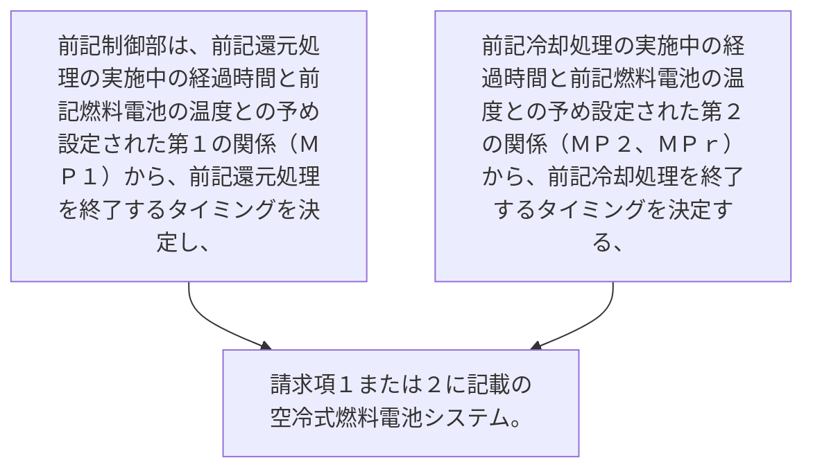

前記制御部は、前記還元処理の実施中の経過時間と前記燃料電池の温度との予め設定された第１の関係（ＭＰ１）から、前記還元処理を終了するタイミングを決定し、前記冷却処理の実施中の経過時間と前記燃料電池の温度との予め設定された第２の関係（ＭＰ２、ＭＰｒ）から、前記冷却処理を終了するタイミングを決定する、請求項１または２に記載の空冷式燃料電池システム。

```mermaid
flowchart TD
A[前記制御部は、前記還元処理の実施中の経過時間と前記燃料電池の温度との予め設定された第１の関係（ＭＰ１）から、前記還元処理を終了するタイミングを決定し、]
B[前記冷却処理の実施中の経過時間と前記燃料電池の温度との予め設定された第２の関係（ＭＰ２、ＭＰｒ）から、前記冷却処理を終了するタイミングを決定する、]
C[請求項１または２に記載の空冷式燃料電池システム。]
A --> C
B --> C
```